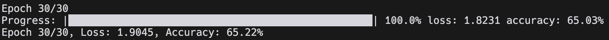
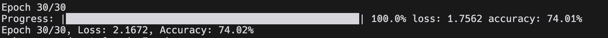
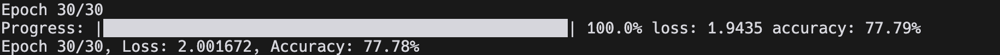
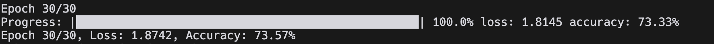

# Performance Benchmarks

## Training Performance

### Network Architecture Comparison

| Architecture | Training Time | Final Accuracy |
|--------------|---------------|----------------|
| [64,128,64,6] | 15m | 65.03% |
| [64,256,128,64,6] | 32m | 74.02% |
| [64,512,256,128,64,6] | 68m | 77.78% |

### Optimizer Comparison

| Optimizer | Convergence Speed | Final Accuracy |
|-----------|------------------|----------------|
| Adam | Fast | 77.78% |
| SGD | Slow | 73.57% |

### Learning Rate Impact

| Learning Rate | Convergence | Stability |
|--------------|-------------|-----------|
| 0.0005 | Slow | Very Stable |
| 0.001 | Medium | Stable |
| 0.01 | Fast | Unstable |

## Hardware Environment
All benchmarks were performed on MacOS and Ubuntu:
- Ubuntu:
- CPU: 11th Gen Intel® Core™ i5-1155G7
- RAM: 16GB DDR4
- OS: Ubuntu 24.04
#
- MacOS:
- CPU: Intel Core i5-8257U
- RAM: 16 Go 3733 MHz LPDDR4X
- OS: MacOS Sequoia 15.2
